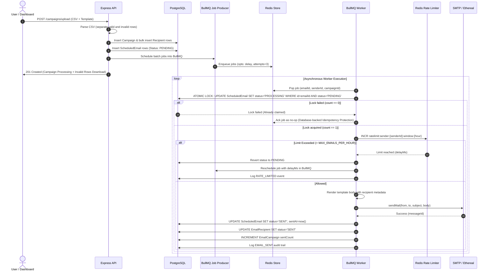
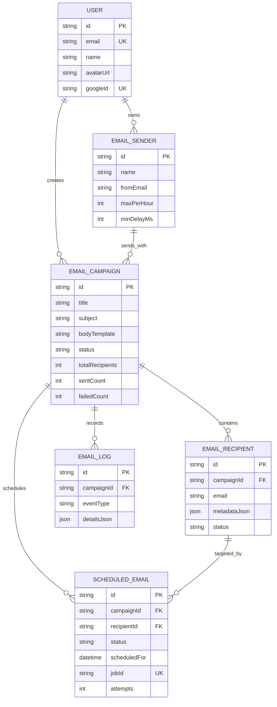

# MailOrchestrator - System Architecture & Technical Specifications

This document outlines the engineering architecture, concurrency design, idempotency model, rate limiting algorithm, and worker monitoring strategy of **MailOrchestrator**.

---

## 1. High-Level System Architecture Diagram

```mermaid
graph TD
    Client["Next.js 15 Frontend (Google OAuth)"]
    API["Express REST API Service (Clean Arch)"]
    DB[("PostgreSQL DB (Source of Truth)")]
    Redis[("Redis (BullMQ & Atomic Counters)")]
    Worker1["BullMQ Email Worker Node 1"]
    Worker2["BullMQ Email Worker Node 2"]
    SMTP["Nodemailer Transporter (SMTP / Ethereal)"]

    Client -->|HTTP REST / Cookies| API
    API -->|Prisma ORM Queries & Status Locks| DB
    API -->|Enqueue Delayed / Batch Jobs| Redis
    Worker1 -->|Poll & Pop Jobs| Redis
    Worker2 -->|Poll & Pop Jobs| Redis
    Worker1 -->|Atomic Status Lock PENDING->PROCESSING| DB
    Worker2 -->|Atomic Status Lock PENDING->PROCESSING| DB
    Worker1 -->|Check Hourly Rate Limit (INCR)| Redis
    Worker2 -->|Check Hourly Rate Limit (INCR)| Redis
    Worker1 -->|Dispatch Outbound Mail| SMTP
    Worker2 -->|Dispatch Outbound Mail| SMTP
    Worker1 -->|Update State to SENT| DB
    Worker2 -->|Update State to SENT| DB
```

---

## 2. Campaign & Job Lifecycle Sequence Diagram



---

## 3. Entity-Relationship (ER) Model Diagram



---

## 4. Database-backed Idempotency Protection

In distributed email worker clusters, duplicate job execution can occur due to worker crashes or network timeouts. MailOrchestrator enforces **Database-backed Idempotency Protection**:

```typescript
const result = await prisma.scheduledEmail.updateMany({
  where: {
    id: emailId,
    status: ScheduledEmailStatus.PENDING, // Conditional status check
  },
  data: {
    status: ScheduledEmailStatus.PROCESSING, // Atomic state transition
    attempts: { increment: 1 },
  },
});

if (result.count === 0) {
  // Lock failed: another worker node or retry attempt already claimed/sent this email.
  return { status: 'skipped_duplicate' };
}
```

---

## 5. Redis Atomic Rate Limiting Algorithm

- **Key Format**: `ratelimit:sender:{senderId}:window:{hourTimestamp}`
- **Atomic Counter**: Uses Redis `INCR` to track outbound emails sent within the current hour window.
- **Window Reset Calculation**:
  $$\text{DelayMs} = \text{NextHourTimestamp} - \text{CurrentTime}$$
- When a worker encounters an over-limit counter (`currentCount > maxPerHour`), it reverts DB status to `PENDING` and enqueues a delayed job in BullMQ scheduled for $\text{DelayMs}$ into the future, preserving order without dropping jobs.
