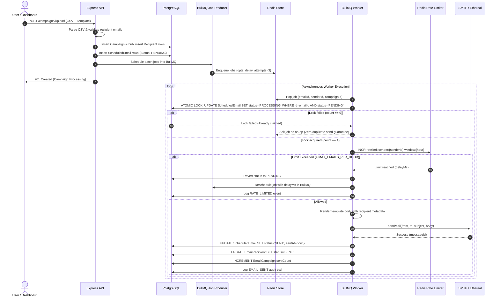

# MailOrchestrator - System Architecture & Technical Specifications

This document outlines the engineering architecture, concurrency design, idempotency model, rate limiting algorithm, and crash recovery strategy of **MailOrchestrator**.

---

## 1. High-Level Architecture Diagram

```mermaid
graph TD
    Client["Next.js 15 Dashboard (React Query)"]
    API["Express REST API Service (Clean Arch)"]
    DB[("PostgreSQL DB (Source of Truth)")]
    Redis[("Redis (BullMQ & Atomic Counters)")]
    Worker1["BullMQ Email Worker Node 1"]
    Worker2["BullMQ Email Worker Node 2"]
    SMTP["Nodemailer Transporter (SMTP / Ethereal)"]

    Client -->|HTTP REST / Cookies| API
    API -->|Prisma ORM Queries & Locks| DB
    API -->|Enqueue Jobs (Delayed/Bulk)| Redis
    Worker1 -->|Poll & Pop Jobs| Redis
    Worker2 -->|Poll & Pop Jobs| Redis
    Worker1 -->|Atomic Status Lock PENDING->PROCESSING| DB
    Worker2 -->|Atomic Status Lock PENDING->PROCESSING| DB
    Worker1 -->|Check Hourly Rate Limit (INCR)| Redis
    Worker2 -->|Check Hourly Rate Limit (INCR)| Redis
    Worker1 -->|Dispatch Outbound Mail| SMTP
    Worker2 -->|Dispatch Outbound Mail| SMTP
    Worker1 -->|Update State to SENT| DB
    Worker2 -->|Update State to SENT| DB
```

---

## 2. Campaign & Job Lifecycle Sequence Diagram



---

## 3. Idempotency & Zero Duplicate Send Guarantees

### Problem Statement
In distributed email workers, duplicate job execution can occur due to:
1. Worker crash immediately after sending email before acknowledging job to BullMQ.
2. Network timeout between worker and BullMQ causing BullMQ to re-assign the job to another worker.
3. Concurrent parallel workers picking up identical scheduled times.

### Architectural Solution
MailOrchestrator enforces **Database-Level Atomic Conditional Status Locking**:

```typescript
const result = await prisma.scheduledEmail.updateMany({
  where: {
    id: emailId,
    status: ScheduledEmailStatus.PENDING, // Conditional check
  },
  data: {
    status: ScheduledEmailStatus.PROCESSING, // Atomic state transition
    attempts: { increment: 1 },
  },
});

if (result.count === 0) {
  // Lock failed: another worker or retry has already claimed or completed this email.
  // Job exits cleanly as a no-op!
  return { status: 'skipped_duplicate' };
}
```

Because PostgreSQL executes `UPDATE ... WHERE status = 'PENDING'` under strict row-level lock isolation, **only one worker process can succeed** in transitioning the state. Any duplicate or retried job will see `result.count === 0` and terminate without invoking SMTP.

---

## 4. Rate Limiting Strategy

MailOrchestrator implements a **Redis-backed Atomic Sliding Window Rate Limiter**:

- **Key Format**: `ratelimit:sender:{senderId}:window:{hourTimestamp}`
- **Atomic Counter**: Uses Redis `INCR` to track outbound emails sent within the current hour window.
- **Window Reset Calculation**:
  $$\text{DelayMs} = \text{NextHourTimestamp} - \text{CurrentTime}$$
- When a worker encounters an over-limit counter (`currentCount > maxPerHour`), it:
  1. Reverts the DB status to `PENDING`.
  2. Enqueues a delayed job in BullMQ scheduled for $\text{DelayMs}$ into the future.
  3. Preserves exact email delivery order without discarding any jobs.

---

## 5. Crash Recovery & Safe Worker Restarts

1. **BullMQ Persistence**: Delayed and pending jobs reside in Redis. Worker process restarts do not clear job states.
2. **Heartbeat Monitoring**: Workers register their status and concurrency in the `WorkerState` PostgreSQL table every 15 seconds.
3. **Database Consistency**: PostgreSQL acts as the single source of truth. If a worker crashes mid-execution, BullMQ's automatic visibility timeout will re-deliver the job. The idempotent conditional lock will evaluate if SMTP was executed or if the job should be safely retried.
